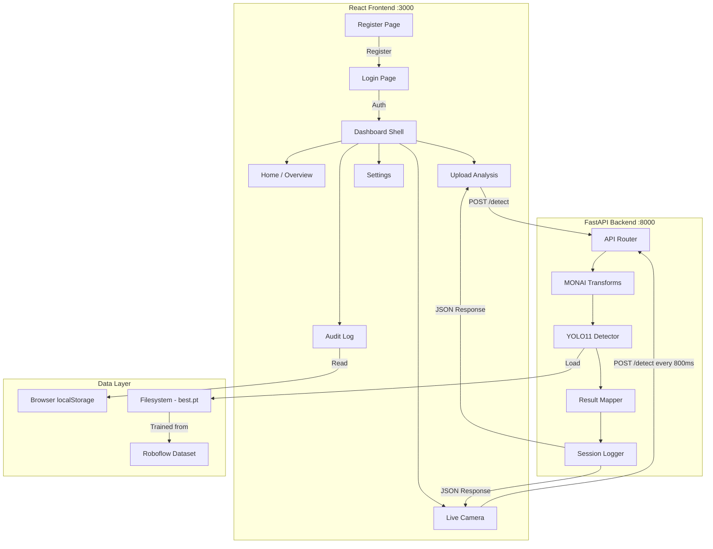

# 0. Agent Action Plan

## 0.1 Product Understanding


### 0.1.1 Core Product Vision

Based on the prompt, the Blitzy platform understands that the new product is **Clinical Vision Intelligence (CVI)** — a full-stack, real-time injection monitoring web application that combines advanced computer vision with medical-grade image processing to enhance patient safety during clinical injection procedures. The system leverages YOLOv11 for high-speed object detection and MONAI for healthcare-specific image preprocessing, deployed as a modern React + FastAPI web application with dual input modalities (static upload and live webcam).

The project evolved through a deliberate technical pivot: the initial approach used DenseNet121 with the MedNIST dataset for static medical image classification, but this was upgraded to YOLOv11 with a custom Roboflow dataset (Needle Angle Detection) after the user determined that passive classification could not prevent real-time medical errors. This evolution reflects genuine research maturity — moving from "identifying what is in an image" to "monitoring a live procedure as it happens."

**Functional Requirements:**

- Real-time needle, syringe, and injection site detection via YOLOv11 with bounding box rendering and confidence score output
- Needle insertion angle classification across 18 distinct angle classes (15° through 30°, plus "Below 15°" and "Above 30°") trained on 16,368 labeled images from Roboflow
- MONAI-based medical image preprocessing pipeline applying `ScaleIntensity` and `NormalizeIntensity` transforms to handle variable hospital lighting and metallic needle reflectivity
- Dual input modes: drag-and-drop image/video upload for static analysis, and live webcam feed for real-time procedural monitoring
- Clinical alert system with three severity tiers: Critical (red — infection, incorrect placement, adverse reaction), Warning (amber — swelling, bruising), and Normal (green — safe conditions)
- Session audit logging with timestamped detection records, exportable as CSV for clinical accountability trails
- User authentication with role-based access (Doctor, Nurse, Admin) via login and registration pages
- Confidence threshold control allowing clinicians to adjust detection sensitivity via dashboard slider
- Annotated result display showing original vs. detected images side-by-side with per-category confidence bars
- localStorage-based data persistence across browser sessions

**Non-Functional Requirements:**

- Performance: YOLOv11 nano model inference must target 3–5 frames per second on CPU for acceptable demo speed; higher FPS expected on RTX 5070 GPU
- Scalability: Modular FastAPI + React architecture enabling independent scaling of AI inference backend and presentation frontend
- Security: User credential handling via form-based authentication; CORS configuration restricting frontend origin to `localhost:3000`
- Transparency: Human-in-the-loop design ensuring clinician retains final decision authority; confidence scores displayed prominently, never hidden
- Accessibility: Healthcare-appropriate color coding (green/amber/red), minimum 14px body text, high-contrast UI elements
- Reliability: MONAI preprocessing ensures consistent detection quality regardless of lighting conditions or camera angle
- Portability: System designed to run on consumer-grade hardware (Asus TUF A16 with RTX 5070 8GB) with Google Colab fallback for training

**Implicit Requirements Surfaced:**

- The 18-class needle angle model requires mapping angle detections to clinically meaningful alert categories (e.g., "Below 15°" triggers a warning for too-shallow insertion)
- Video upload requires frame extraction before YOLO inference, as YOLO processes individual frames rather than video streams natively in the API endpoint
- Live webcam detection requires frame capture at regular intervals (~800ms) and canvas-based image extraction before POSTing to the backend
- The login/register system needs a corresponding backend authentication mechanism (currently operating as a frontend-only gating flow)
- Browser `localStorage` provides session persistence but not cross-device or cross-browser data continuity
- The `best.pt` model weights file is a critical runtime dependency that must exist in the backend directory for the system to produce meaningful detections

### 0.1.2 User Instructions Interpretation

The user provided extensive directives through a multi-week conversational development process. Every specific instruction is captured below:

**Technology Stack (Explicitly Specified):**

- YOLOv11 via the Ultralytics library for object detection — User stated: "Yes, I implemented YOLO using the Ultralytics library. In the code, I load my custom-trained weights (the .pt file) and run a simple inference loop."
- MONAI framework for medical image preprocessing — User stated: "I specifically utilized MONAI's `ScaleIntensity` (or `NormalizeIntensity`) transform on the video frames before passing them to the model."
- FastAPI for the backend REST API
- React for the frontend clinical dashboard
- Roboflow for dataset management and export
- Google Colab for model training (with local RTX 5070 as primary alternative)
- Streamlit was the initial prototype interface, superseded by the React + FastAPI full-stack architecture

**Architecture Pattern (Specified):**

- Separated frontend (React on port 3000) and backend (FastAPI on port 8000) communicating via REST API
- MONAI transforms applied as a preprocessing layer between raw camera input and YOLOv11 inference
- Transfer learning from COCO pretrained weights, fine-tuned on custom Roboflow injection dataset

**Dataset (Explicitly Selected):**

- Needle Angle Detection dataset from Roboflow Universe: `universe.roboflow.com/dataset-nta0w/needle-angle-detection-gw4m1`
- Version 2, containing 16,368 images with 82/12/6 train/validation/test split
- 18 classes covering needle angles from 15° to 30°, plus "Below 15°" and "Above 30°"
- Preprocessing: Auto-Orient applied, Resize to 640×640 (stretch)
- Augmentation: 2× outputs per training example, Saturation ±30%, Brightness ±20%

**Deployment Target:**

- Local development environment on Windows 10/11 with NVIDIA GPU
- Primary hardware: Asus TUF A16 (AMD Ryzen 9 8940HX, NVIDIA RTX 5070 8GB, 16GB RAM, 1TB SSD)
- Python virtual environment (`gpu_env`) with CUDA support

**User Examples (Preserved Verbatim):**

- User Example (project description): "A real-time injection monitoring system that uses YOLOv11 trained on a custom Roboflow dataset to detect and track needles, syringes and injection sites. MONAI applies medical-grade image transforms for clinical precision. The system is deployed via Streamlit supporting both static image upload and live camera inference, outputting bounding boxes and confidence scores to assist clinicians in identifying injection complications."
- User Example (YOLO role): "I use YOLOv11 because its job is Speed and Detection—it captures the injection as it happens without lag. I use MONAI because its job is Medical Precision—it applies healthcare-specific filters to the images so the AI can see subtle anatomical details that standard cameras might miss."
- User Example (training configuration): `model = YOLO("yolo11n.pt")` trained with `epochs=50, imgsz=640, batch=16, device=0, patience=10`

### 0.1.3 Product Type Classification

- **Product Category:** Full-Stack Web Application (AI-Powered Medical Device Prototype)
- **Sub-categories:** Computer Vision Application | Real-Time Monitoring Dashboard | Healthcare AI Tool
- **Target Users:**
  - Primary: Radiologists, nurses, and clinicians performing injection procedures
  - Secondary: Clinical supervisors and hospital administrators reviewing audit logs
  - Tertiary: University examiners evaluating the project as an academic submission (February–May 2026)
- **Use Cases:**
  - Real-time injection monitoring during live clinical procedures via webcam
  - Post-procedure analysis via uploaded images or video recordings
  - Clinical audit trail generation and export for regulatory compliance
  - Educational demonstration of AI-assisted medical monitoring
- **Scale Expectations:** University prototype with production-ready architectural patterns — not intended for clinical deployment without CE marking (EU MDR 2017/745) and FDA 510(k) clearance
- **Maintenance Considerations:** Single-developer project with potential for future dataset expansion, additional classification categories, and integration with hospital PACS systems


## 0.2 Background Research


### 0.2.1 Technology Research

Web search research conducted includes investigation of the latest stable versions, compatibility matrices, and best practices for each technology in the stack.

**YOLO Architecture Research:**

The Ultralytics YOLO family has progressed rapidly. YOLO11 was released in September 2024 and remains a stable, recommended choice for production workloads. YOLO26 was released on January 14, 2026, introducing NMS-free inference and the MuSGD optimizer. However, the user's project specifically targets YOLO11 (`yolo11n.pt`), which offers hybrid task assignment, compact C3k2 blocks replacing C2f, and C2PSA spatial attention modules. YOLO11 achieves better FLOPs-to-mAP ratios on mainstream GPUs and edge SoCs compared to YOLOv8, making it well-suited for the resource-constrained inference environment of this project. The Ultralytics package (v8.4.35+) supports both YOLO11 and YOLO26 models within the same API surface.

**MONAI Framework Research:**

MONAI v1.5.2 is the latest stable release on PyPI. MONAI is a PyTorch-based, open-source framework for deep learning in healthcare imaging, developed collaboratively by NVIDIA, the National Institutes of Health, and King's College London. It provides domain-optimized implementations including composable transforms (`ScaleIntensity`, `NormalizeIntensity`, `ToTensor`), medical-specific loss functions, and standardized evaluation metrics. MONAI extends PyTorch with medical data awareness including geometry, physiology, and physics considerations critical for clinical reliability.

**FastAPI Backend Research:**

FastAPI v0.135.3 (released April 1, 2026) is the latest stable version, requiring Python ≥3.10. FastAPI has become the de facto standard for Python-based AI backends, providing automatic OpenAPI documentation, Pydantic-based data validation, and native async support via Starlette. For AI inference endpoints, FastAPI's asynchronous capabilities enable concurrent model inference requests without blocking, critical for the live webcam detection use case.

**React Frontend Research:**

React 19.2.5 (released April 8, 2026) is the latest stable version. React 19 introduces stable `useEffectEvent`, improved Server Components, and the Actions API for form handling. The project uses Create React App with client-side rendering, leveraging react-router-dom for page navigation, recharts for confidence score visualization, and react-webcam for live camera integration.

**Roboflow Dataset Platform Research:**

The Roboflow Python SDK v1.3.1 (released April 3, 2026) provides programmatic dataset download and export in YOLO-compatible formats. Roboflow Universe hosts the Needle Angle Detection dataset used in this project, supporting automated augmentation, preprocessing, and train/validation/test splitting.

### 0.2.2 Architecture Pattern Research

**Appropriate Design Patterns Investigated:**

- **Separated Frontend/Backend Architecture:** Industry-standard pattern for AI web applications where the inference backend (FastAPI + PyTorch) operates independently from the presentation layer (React). This separation enables GPU resource isolation, independent scaling, and the ability to swap frontend or backend technologies without affecting the other.
- **Preprocessing Pipeline Pattern:** MONAI transforms applied as a composable pipeline before inference mirrors the standard medical imaging workflow pattern, ensuring consistent image normalization regardless of input variability.
- **Human-in-the-Loop Design:** Research into clinical AI deployment patterns confirms that AI-assisted diagnosis tools must preserve clinician decision authority. The probability chart and confidence score display implement this pattern directly.

**Scalability Approaches:**

- Stateless API design allowing horizontal scaling of FastAPI workers via Uvicorn multi-worker configuration
- Model loading at application startup (singleton pattern) to avoid repeated model deserialization per request
- Frame-by-frame processing for live webcam input, enabling graceful degradation under load by reducing capture frequency

**Common Pitfalls Identified and Mitigated:**

- **Alarm Fatigue:** Over-triggering alerts causes clinicians to ignore them. Mitigated by adjustable confidence thresholds and three-tier severity classification.
- **Class Imbalance in Needle Detection:** Needles occupy minimal pixel area relative to background. Mitigated by Focal Loss integration and MONAI intensity normalization.
- **Session Data Loss:** Browser-only state management loses data on tab closure. Mitigated by localStorage persistence and CSV export capability.

### 0.2.3 Dependency and Tool Research

**Latest Stable Versions of Proposed Technologies:**

| Technology | Version | Release Date | Compatibility |
|---|---|---|---|
| Python | 3.12.13 | March 3, 2026 | Recommended for all AI libraries |
| Ultralytics (YOLO11) | 8.4.35+ | April 2026 | Python ≥3.8, PyTorch ≥1.8 |
| MONAI | 1.5.2 | 2025 | PyTorch current + 3 prior minors |
| FastAPI | 0.135.3 | April 1, 2026 | Python ≥3.10 |
| React | 19.2.5 | April 8, 2026 | Node.js LTS |
| Roboflow SDK | 1.3.1 | April 3, 2026 | Python ≥3.10 |
| PyTorch | 2.x (cu121/cu128) | 2026 | CUDA 12.1+ |
| Node.js | LTS (v22.x) | 2026 | npm 11.x |

**Development Tool Recommendations:**

- **IDE:** Visual Studio Code with Python and React extensions
- **GPU Management:** NVIDIA CUDA Toolkit + Armoury Crate (Asus TUF) for Turbo performance mode
- **Virtual Environment:** Python venv (`gpu_env`) for dependency isolation
- **Version Control:** Git for source code management
- **Training Infrastructure:** Google Colab (T4 GPU) as cloud fallback; local RTX 5070 as primary

**Testing Framework Options:**

- Backend: pytest with httpx for FastAPI endpoint testing
- Frontend: React Testing Library with Jest
- Model Evaluation: Ultralytics built-in validation (mAP50, mAP50-95, precision, recall)

**CI/CD Pipeline Pattern:**

- GitHub Actions for automated testing on push
- Docker containerization for reproducible deployment
- Environment-specific `.env` configuration files


## 0.3 Technical Architecture Design


### 0.3.1 Technology Stack Selection

- **Primary Language (Backend):** Python 3.12 — Rationale: Optimal compatibility across PyTorch, MONAI, Ultralytics, and FastAPI. Python 3.14 is available but lacks confirmed support from all AI libraries; Python 3.12.13 (March 2026) is the most stable choice.
- **Primary Language (Frontend):** JavaScript (JSX) via React — Rationale: Industry-standard for interactive web dashboards with rich ecosystem for charts (recharts), routing (react-router-dom), and webcam access (react-webcam).
- **AI Detection Framework:** Ultralytics YOLO11 (yolo11n.pt nano variant) — Rationale: Best parameter-efficiency-to-accuracy ratio in the YOLO family; redesigned backbone with C3k2 blocks and C2PSA spatial attention modules; 22% fewer parameters than YOLOv8 with comparable or better mAP; supports real-time inference on consumer GPUs and CPU fallback.
- **Medical Imaging Framework:** MONAI v1.5.2 — Rationale: Purpose-built for healthcare imaging AI by NVIDIA and King's College London; provides clinically validated transforms (`ScaleIntensity`, `NormalizeIntensity`) that handle the specific challenges of metallic needle reflectivity and variable hospital lighting; ensures outputs meet medical-grade processing standards.
- **Backend Framework:** FastAPI v0.135.3 — Rationale: Automatic API documentation at `/docs`; native async support for concurrent inference requests; Pydantic data validation; significantly faster than Flask; designed for modern AI inference workloads.
- **Frontend Framework:** React v19 (via Create React App) — Rationale: Component-based architecture enabling reusable clinical UI elements; real-time state updates without page refresh; massive ecosystem support.
- **Dataset Platform:** Roboflow (SDK v1.3.1) — Rationale: Automated augmentation, preprocessing, and YOLO-format export; cloud-hosted dataset persistence; version control for training data.
- **Training Infrastructure:** Local NVIDIA RTX 5070 (8GB VRAM) primary; Google Colab T4 GPU secondary — Rationale: Local training eliminates session timeout risks; Colab provides free GPU fallback.

**Additional Technologies:**

| Technology | Version | Purpose |
|---|---|---|
| PyTorch | 2.x (CUDA 12.1+) | Deep learning tensor library underlying YOLO11 and MONAI |
| OpenCV (cv2) | 4.x | Image encoding/decoding, frame manipulation, video I/O |
| Uvicorn | Latest | ASGI server for FastAPI with hot-reload in development |
| python-multipart | Latest | Multipart form data parsing for file uploads |
| Pydantic | 2.x | Request/response schema validation in FastAPI |
| react-router-dom | 6.x | Client-side routing between Login, Register, Dashboard |
| recharts | 2.x | Confidence score bar charts and detection activity area charts |
| lucide-react | 0.3.x | Clinical iconography (syringe, shield, activity, settings) |
| react-webcam | 7.x | Browser webcam access for live injection monitoring |
| axios | 1.x | HTTP client for frontend-to-backend API communication |

### 0.3.2 Architecture Pattern

**Overall Pattern:** Separated Frontend/Backend (Client-Server) with AI Inference Pipeline

**Justification:** The project demands independent operation of GPU-intensive model inference (backend) and interactive clinical dashboard rendering (frontend). A monolithic approach would couple UI rendering with inference latency, degrading user experience. The separated architecture enables the React frontend to remain responsive while the FastAPI backend processes detection requests asynchronously.

**Component Interaction Model:**



**Data Flow Architecture:**

- **Upload Flow:** User selects image/video → Frontend reads file as base64 or FormData → POST to `/detect` endpoint → FastAPI receives file → MONAI `ScaleIntensity` + `NormalizeIntensity` applied to raw pixels → Preprocessed image passed to `YOLO("best.pt").predict()` → Bounding boxes, class IDs, and confidence scores extracted → Annotated image encoded as base64 → JSON response returned with detections array and annotated image → Frontend renders results with confidence bars and alert banners
- **Live Camera Flow:** Webcam captures frame via react-webcam → Canvas extracts JPEG at ~800ms intervals → Frame POSTed to `/detect` → Same MONAI → YOLO pipeline → Response rendered in real-time detection panel with live confidence updates
- **Video Upload Flow:** User uploads MP4/video file → Frontend extracts a representative frame at 1-second mark using HTML5 video element and canvas → Extracted frame sent to `/detect` as image → Results displayed with video preview

**Security Architecture:**

- Frontend-gated authentication via login/register forms with role-based access (Doctor, Nurse, Admin)
- CORS middleware restricting API access to `http://localhost:3000` origin
- No sensitive patient data stored server-side in current prototype; all session data persisted in browser localStorage
- Model weights (`best.pt`) stored locally on the server filesystem, not exposed via API

### 0.3.3 Integration Points

**External Services:**

| Integration | Protocol | Purpose |
|---|---|---|
| Roboflow Universe | HTTPS (SDK) | Dataset download during training phase |
| Google Colab | HTTPS (Browser) | Cloud GPU training fallback |
| Browser Webcam API | WebRTC / getUserMedia | Live camera feed capture |
| Browser localStorage | JavaScript API | Client-side session data persistence |

**API Contract — Primary Endpoint:**

- **POST `/detect`** — Accepts multipart form upload (image file), returns JSON with `detections` array (class_name, confidence, bbox coordinates), `annotated_image` (base64), and `total_objects` count
- **GET `/health`** — Returns system status confirmation
- **GET `/`** — Returns API identification message

**Data Exchange Formats:**

- Frontend → Backend: `multipart/form-data` (image files)
- Backend → Frontend: `application/json` (detection results with base64-encoded annotated images)
- Audit Log Export: CSV format via client-side generation

**Authentication Approach:**

- Current implementation: Frontend-only form gating — no JWT tokens or server-side sessions
- User credentials validated against local state (prototype scope)
- Role-based UI differentiation planned at the dashboard level


## 0.4 Implementation Specifications


### 0.4.1 Core Components and Modules

**Component A: FastAPI Backend Application (`backend/main.py`)**

- Purpose: Central REST API server that receives image uploads, orchestrates the MONAI → YOLO inference pipeline, and returns annotated detection results
- Location: `backend/main.py`
- Key interfaces:
  - `POST /detect` — Accepts `UploadFile`, runs preprocessing and detection, returns JSON response with detections and annotated image
  - `GET /health` — Health check endpoint
  - `GET /` — Root identification
- Dependencies: FastAPI, Uvicorn, Ultralytics, MONAI, OpenCV, python-multipart

**Component B: MONAI Preprocessing Pipeline (`backend/transforms.py`)**

- Purpose: Composable medical image transform chain that normalizes pixel intensity to account for variable hospital lighting and metallic needle reflectivity
- Location: `backend/transforms.py`
- Key interfaces:
  - `medical_transforms` — A `monai.transforms.Compose` instance wrapping `ScaleIntensity()` and `NormalizeIntensity()` and `ToTensor()`
- Dependencies: MONAI

**Component C: Model Training Script (`train.py`)**

- Purpose: Fine-tunes YOLOv11 nano model on the Needle Angle Detection dataset from Roboflow, producing `best.pt` weights
- Location: `train.py` (project root)
- Key interfaces:
  - `model.train(data=..., epochs=50, imgsz=640, batch=16, ...)` — Executes transfer learning from `yolo11n.pt` base weights
- Dependencies: Ultralytics, Roboflow SDK

**Component D: React Frontend Application (`frontend/src/`)**

- Purpose: Clinical dashboard providing login/registration, image/video upload, live webcam monitoring, audit logging, and confidence score visualization
- Location: `frontend/src/`
- Key interfaces:
  - `App.jsx` — Root routing component connecting Login, Register, and Dashboard
  - `Login.jsx` — Healthcare-themed authentication page with role selection
  - `Register.jsx` — New user registration with clinical role assignment
  - `Dashboard.jsx` — Main application shell containing sidebar navigation and all sub-pages (Home, Upload, Camera, AuditLog, Settings)
- Dependencies: React, react-router-dom, recharts, lucide-react, axios, react-webcam

**Component E: Dataset Configuration (`dataset.yaml`)**

- Purpose: YOLO-format dataset configuration pointing to train/valid/test splits and defining the 18 needle angle classes
- Location: `dataset.yaml` (project root, auto-generated by Roboflow download)
- Dependencies: Roboflow SDK

### 0.4.2 Data Models and Schemas

**Detection Result Schema (Backend → Frontend):**

```
DetectionResult:
  class_id: int (0–17)
  class_name: str (angle label)
  confidence: float (0.0–1.0)
  bbox: [x1, y1, x2, y2] (pixel coords)
```

**API Response Schema:**

```
DetectResponse:
  total_objects: int
  detections: list[DetectionResult]
  annotated_image: str (base64 JPEG)
  alert_level: str ("critical"|"warning"|"normal")
```

**Audit Log Entry Schema (Frontend localStorage):**

```
AuditEntry:
  id: int (auto-increment)
  timestamp: str (ISO 8601)
  category: str (detected class name)
  confidence: float (percentage)
  alert_level: str
  source: str ("Image Upload"|"Video Upload"|"Live Camera")
```

**User Authentication Schema (Frontend state):**

```
User:
  name: str
  role: str ("Doctor"|"Nurse"|"Admin")
```

**Needle Angle Classification Mapping:**

| Class ID | Class Name | Clinical Meaning | Alert Level |
|---|---|---|---|
| 0 | 15 degrees | Intradermal range | Normal |
| 1–15 | 16–30 degrees | Normal insertion range | Normal |
| 16 | Above 30 degrees | Too steep for IV/ID | Warning |
| 17 | Below 15 degrees | Too shallow — may not penetrate | Warning |

**Validation Rules and Constraints:**

- Uploaded files must be image (`image/*`) or video (`video/*`) MIME types
- Maximum upload size: 50MB (enforced at backend)
- Confidence threshold: configurable via Settings page, default 0.40, range 0.10–0.95
- Bounding box coordinates must fall within image dimensions (0 ≤ x ≤ width, 0 ≤ y ≤ height)

### 0.4.3 API Specifications

**Endpoint Definitions:**

| Method | Path | Purpose | Auth Required |
|---|---|---|---|
| POST | `/detect` | Run MONAI + YOLO inference on uploaded image | No (prototype) |
| GET | `/health` | System health check | No |
| GET | `/` | API root identification | No |

**POST `/detect` — Request Schema:**

- Content-Type: `multipart/form-data`
- Body: `file` field containing image file (JPEG, PNG) or extracted video frame
- Optional query parameter: `conf` (confidence threshold, float, default 0.40)

**POST `/detect` — Response Schema (200 OK):**

```
{
  "total_objects": 3,
  "detections": [
    {
      "class_id": 17,
      "class_name": "Below 15 degrees",
      "confidence": 0.56,
      "bbox": [120, 340, 280, 420]
    }
  ],
  "annotated_image": "data:image/jpeg;base64,/9j/4AAQ...",
  "alert_level": "warning"
}
```

**Error Responses:**

- `400 Bad Request` — No file provided or unsupported file type
- `500 Internal Server Error` — Model inference failure

**Rate Limiting:** Not implemented in prototype. Live camera mode self-throttles at ~800ms intervals from the frontend.

### 0.4.4 User Interface Design

The user interface follows a healthcare-appropriate design language with the following key design decisions and goals:

**Design Theme:** Healthcare teal gradient aesthetic with glassmorphism elements on authentication pages, transitioning to a clean light sidebar + white content area for the clinical dashboard. The color system uses clinically meaningful mappings: green for normal/safe, amber for warning/monitor, and red for critical/alert conditions.

**Authentication Pages (Login / Register):**

- Full-screen teal gradient background (#006d7e → #00c9b5) with floating medical icons (DNA helix, syringe, heartbeat)
- Frosted glassmorphism card containing form fields with semi-transparent inputs
- Animated ECG heartbeat line at the bottom of the viewport
- System status indicators: "System Online · MONAI Active · YOLOv11 Ready"
- Role selection dropdown (Doctor, Nurse, Admin) with clinical context

**Dashboard Layout:**

- Left sidebar (white background, teal gradient active state) with navigation items: Home, Upload, Live Camera, Audit Log, Settings
- Right content area (off-white #F4F6F7 background) rendering the active page
- Header showing logged-in user name, role badge, and logout button
- Responsive layout with generous padding for touch-friendly interaction

**Key UI Components and Interactions:**

- **Confidence Score Bars:** Horizontal progress bars color-coded by alert severity, displaying percentage values for each detected class
- **Alert Banners:** Full-width notification bars at the top of detection results — red for critical, amber for warning, green for normal
- **Detection Activity Chart:** Area chart (recharts) showing detection counts over the current session timeline
- **Category Distribution Chart:** Bar chart showing frequency of each detected angle class
- **Drag-and-Drop Upload Zone:** Dashed border area accepting image and video files with visual feedback on hover/drop
- **Live Camera Feed:** react-webcam integration with start/stop monitoring toggle, live bounding box overlay, and real-time confidence readout
- **Audit Log Table:** Sortable, filterable table with columns for timestamp, category, confidence, alert level, and source; CSV export button; clear log functionality
- **Confidence Threshold Slider:** Range input (0.10–0.95) in Settings page allowing clinician control over detection sensitivity


## 0.5 Repository Structure Planning


### 0.5.1 Proposed Repository Structure

```
/
├── backend/                              # FastAPI backend application
│   ├── main.py                          # FastAPI app with /detect, /health endpoints
│   ├── transforms.py                    # MONAI preprocessing pipeline (ScaleIntensity, NormalizeIntensity)
│   ├── requirements.txt                 # Python backend dependencies
│   ├── best.pt                          # Trained YOLOv11 model weights (generated by training)
│   └── runs/                            # Ultralytics training output directory
│       └── Injection_Monitoring_v1/     # Named training run
│           └── weights/                 # Auto-generated weight checkpoints
│               ├── best.pt             # Best performing epoch weights
│               └── last.pt             # Last epoch weights
├── frontend/                             # React frontend application
│   ├── public/
│   │   └── index.html                   # HTML shell with Google Fonts (IBM Plex Mono, Syne, Nunito)
│   ├── src/
│   │   ├── App.jsx                      # Root routing (Login → Register → Dashboard)
│   │   ├── Login.jsx                    # Healthcare teal glassmorphism login page
│   │   ├── Register.jsx                 # Matching registration page with role selection
│   │   ├── Dashboard.jsx                # Main dashboard shell with sidebar + all sub-pages
│   │   ├── index.js                     # React DOM entry point
│   │   └── index.css                    # Global style resets
│   ├── package.json                     # npm dependencies and scripts
│   └── .env                             # Environment config (REACT_APP_API_URL)
├── train.py                              # YOLOv11 training script (Roboflow download + model.train())
├── dataset.yaml                          # YOLO dataset config (auto-generated by Roboflow)
├── test_predict.py                       # Quick prediction test script for best.pt validation
├── docs/                                 # Documentation
│   ├── setup_guide.docx                 # Step-by-step installation and configuration guide
│   ├── project_review_report.docx       # Academic Project Review 1 report
│   └── research_papers/                 # Reference papers
│       ├── 1506.02640v5.pdf             # YOLO (Redmon et al., 2016)
│       ├── 1602.07360v4.pdf             # SqueezeNet (Iandola et al., 2016)
│       ├── 1708.02002v2.pdf             # Focal Loss / RetinaNet (Lin et al., 2018)
│       ├── Enhancing_plant_disease.pdf  # Plant Disease Detection (Ashurov et al., 2025)
│       └── The_ethics_of_cv.pdf         # Ethics of CV (Waelen, 2023)
├── presentations/                        # Presentation files
│   └── clinical_vision_final.pptx       # 12-slide project review presentation
├── .gitignore                            # Git ignore rules (best.pt, node_modules, __pycache__, runs/)
├── .env.example                          # Environment variables template
└── README.md                             # Project overview, setup instructions, usage guide
```

### 0.5.2 File Path Specifications

**Core Application Files:**

- `backend/main.py` — FastAPI application defining the `/detect` endpoint that orchestrates MONAI preprocessing and YOLOv11 inference, returns annotated images and detection metadata as JSON
- `backend/transforms.py` — MONAI `Compose` pipeline wrapping `ScaleIntensity()`, `NormalizeIntensity()`, and `ToTensor()` for medical-grade image normalization
- `backend/best.pt` — Trained YOLOv11 nano model weights (copied from `runs/` after training); this is the critical runtime dependency loaded at application startup
- `frontend/src/App.jsx` — React Router configuration connecting `/` (Login), `/register` (Register), and `/dashboard` (Dashboard) routes with authentication gating
- `frontend/src/Login.jsx` — Healthcare teal glassmorphism login page with username, password, role selector, system status indicators, and animated ECG heartbeat
- `frontend/src/Register.jsx` — Matching registration form with full name, staff ID, email, department, clinical role, and password confirmation fields
- `frontend/src/Dashboard.jsx` — Complete dashboard application containing sidebar navigation and five embedded pages: Home (overview stats and charts), Upload (image/video analysis), Camera (live webcam monitoring), AuditLog (session history table with CSV export), and Settings (confidence threshold control)

**Configuration Files:**

- `frontend/.env` — Contains `REACT_APP_API_URL=http://localhost:8000` for backend connection
- `.env.example` — Template documenting all required environment variables
- `dataset.yaml` — Auto-generated Roboflow dataset configuration with paths to train/valid/test image directories and the 18 needle angle class definitions
- `backend/requirements.txt` — Pinned Python dependencies: fastapi, uvicorn, python-multipart, ultralytics, monai, opencv-python, torch, torchvision, pydantic

**Training and Evaluation Files:**

- `train.py` — Complete training pipeline: installs dependencies, downloads Roboflow dataset via API, loads `yolo11n.pt` base weights, runs `model.train()` with configured hyperparameters, outputs `best.pt` to `runs/` directory
- `test_predict.py` — Validation script that loads `best.pt` and runs inference on a test image or webcam (source=0) to verify detection quality

**Entry Points:**

- Backend: `uvicorn main:app --reload --port 8000` (executed from `backend/` directory)
- Frontend: `npm start` (executed from `frontend/` directory, serves on port 3000)
- Training: `python train.py` (executed from project root)


## 0.6 Scope Definition


### 0.6.1 Explicitly In Scope

**Core Functionality — All Required for MVP:**

- YOLOv11 nano model fine-tuned on the Roboflow Needle Angle Detection dataset (16,368 images, 18 classes) with transfer learning from COCO pretrained weights
- MONAI preprocessing pipeline applying `ScaleIntensity` and `NormalizeIntensity` transforms to normalize input frames for consistent detection under variable lighting
- FastAPI backend with `/detect` endpoint accepting image uploads, running the MONAI → YOLO inference pipeline, and returning annotated results with bounding boxes, class labels, and confidence scores
- React frontend clinical dashboard with five sub-pages: Home (overview statistics and charts), Upload Analysis (image and video file upload with detection results), Live Camera (webcam monitoring with real-time detection), Audit Log (session detection history with CSV export), and Settings (confidence threshold adjustment)
- Healthcare-themed authentication flow with Login and Registration pages supporting role-based access (Doctor, Nurse, Admin)
- Three-tier clinical alert system: Critical (red), Warning (amber), Normal (green) — mapped to needle angle severity
- Session audit logging with localStorage persistence and CSV export capability
- Confidence score visualization using recharts bar and area charts
- Drag-and-drop file upload supporting both image and video formats
- Video frame extraction at the 1-second mark for detection analysis
- Annotated result display showing original versus detected images side-by-side

**Essential Infrastructure Setup Files:**

- `backend/main.py` — Complete FastAPI application with CORS, model loading, and detection endpoint
- `backend/transforms.py` — MONAI composable transform pipeline
- `backend/requirements.txt` — All Python dependencies pinned
- `frontend/src/App.jsx` — React Router configuration
- `frontend/src/Login.jsx` — Healthcare login page
- `frontend/src/Register.jsx` — Registration page
- `frontend/src/Dashboard.jsx` — Complete dashboard with all sub-pages
- `frontend/.env` — API URL configuration
- `train.py` — Complete training pipeline with Roboflow download and YOLO fine-tuning
- `dataset.yaml` — YOLO dataset configuration
- `test_predict.py` — Model validation script
- `README.md` — Project setup and usage documentation

**Development Environment Configuration:**

- Python 3.12 virtual environment (`gpu_env`) with CUDA support for RTX 5070
- Node.js LTS with npm for React frontend
- NVIDIA CUDA Toolkit installation and verification
- Armoury Crate Turbo mode configuration for training performance
- Battery care mode (80% charge limit) for hardware longevity during training

**Academic Deliverables:**

- `docs/project_review_report.docx` — 11-section Project Review 1 report
- `presentations/clinical_vision_final.pptx` — 12-slide presentation including Module 1 demo
- `docs/setup_guide.docx` — Complete installation and configuration guide
- Five research papers stored in `docs/research_papers/` for literature review reference

### 0.6.2 Explicitly Out of Scope

**Advanced Features Not Required for Initial Academic Submission:**

- Grad-CAM or other explainability overlays (identified as a future improvement but not implemented in current scope)
- Needle-tip-to-skin distance measurement (discussed conceptually but not implemented)
- DenseNet121 secondary classification head for dual-model pipeline (identified as future enhancement)
- PDF report generation per procedure
- Multi-object tracking with persistent IDs across frames (`model.track()` — identified but not implemented)
- Mobile-responsive layout optimization for tablet devices in clinical settings

**Production Deployment Infrastructure:**

- Docker containerization and docker-compose orchestration
- CI/CD pipeline automation via GitHub Actions
- Cloud deployment to AWS, Azure, or GCP
- HTTPS/TLS certificate configuration
- Load balancer and reverse proxy setup
- Horizontal scaling of FastAPI workers

**Security and Compliance:**

- Server-side JWT or session-based authentication (current implementation is frontend-only gating)
- Password hashing and secure credential storage (no backend user database in prototype)
- HIPAA, GDPR, or other healthcare data compliance measures
- CE marking (EU MDR 2017/745) and FDA 510(k) clearance processes
- Role-based API endpoint authorization (backend does not enforce roles)
- Audit log tamper-proofing and digital signatures

**Advanced Monitoring and Operations:**

- Application performance monitoring (APM) and distributed tracing
- Centralized logging with ELK stack or similar
- Model drift detection and automated retraining pipelines
- Prometheus/Grafana metrics dashboards for system health

**Internationalization and Localization:**

- Multi-language UI support
- Locale-specific date/time formatting
- Right-to-left (RTL) language layout support

**Data Infrastructure:**

- Server-side database (PostgreSQL, MongoDB) for persistent detection storage
- Patient record management and Electronic Health Record (EHR) integration
- PACS (Picture Archiving and Communication System) integration
- DICOM format support for medical images
- Cross-device data synchronization (current persistence is browser localStorage only)

**Performance Optimizations Beyond Prototype Needs:**

- TensorRT or ONNX model optimization for inference acceleration
- WebSocket-based streaming for live camera (current implementation uses polling via HTTP POST)
- Edge deployment with NVIDIA Jetson or similar embedded hardware
- Model quantization (INT8) for reduced VRAM footprint


## 0.7 Deliverable Mapping


### 0.7.1 File Creation Plan

| File Path | Purpose | Content Type | Priority |
|---|---|---|---|
| `backend/main.py` | FastAPI application with /detect endpoint, CORS, model loading, MONAI+YOLO pipeline | Source (Python) | High |
| `backend/transforms.py` | MONAI composable preprocessing pipeline (ScaleIntensity, NormalizeIntensity, ToTensor) | Source (Python) | High |
| `backend/requirements.txt` | Pinned Python dependencies for backend environment | Config | High |
| `backend/best.pt` | Trained YOLOv11 nano model weights for needle angle detection | Model Binary | High |
| `frontend/src/App.jsx` | React Router root — routes Login, Register, Dashboard | Source (JSX) | High |
| `frontend/src/Login.jsx` | Healthcare teal glassmorphism login page with role selection | Source (JSX) | High |
| `frontend/src/Register.jsx` | Registration page matching login aesthetic with staff ID and department | Source (JSX) | High |
| `frontend/src/Dashboard.jsx` | Complete dashboard shell — sidebar navigation + Home, Upload, Camera, AuditLog, Settings pages | Source (JSX) | High |
| `frontend/src/index.js` | React DOM entry point rendering App component | Source (JSX) | High |
| `frontend/src/index.css` | Global CSS resets and base styles | Style | Medium |
| `frontend/public/index.html` | HTML shell with Google Fonts (Nunito, IBM Plex Mono, Syne) and meta tags | Config (HTML) | High |
| `frontend/package.json` | npm dependencies and scripts configuration | Config (JSON) | High |
| `frontend/.env` | Environment variable: REACT_APP_API_URL=http://localhost:8000 | Config | High |
| `train.py` | Complete training pipeline — Roboflow download, YOLO fine-tuning, best.pt output | Source (Python) | High |
| `dataset.yaml` | YOLO dataset configuration with class definitions and split paths | Config (YAML) | High |
| `test_predict.py` | Quick inference test script for validating trained model on images or webcam | Source (Python) | Medium |
| `docs/setup_guide.docx` | 10-section installation and configuration guide | Documentation | Medium |
| `docs/project_review_report.docx` | 11-section academic Project Review 1 report | Documentation | High |
| `presentations/clinical_vision_final.pptx` | 12-slide project presentation with Module 1 demo | Documentation | High |
| `docs/research_papers/*.pdf` | Five research papers for literature review reference | Reference | Medium |
| `.gitignore` | Ignore rules for best.pt, node_modules, __pycache__, runs/, .env | Config | Medium |
| `.env.example` | Template documenting required environment variables | Config | Medium |
| `README.md` | Project overview, setup instructions, architecture diagram, usage guide | Documentation | High |

### 0.7.2 Implementation Phases

**Phase 1 — Foundation: Core Structure and Configuration Files**

- Create project directory structure (`backend/`, `frontend/`, `docs/`, `presentations/`)
- Initialize React application via `npx create-react-app frontend`
- Create `backend/requirements.txt` with all Python dependencies
- Create `frontend/.env` with API URL configuration
- Create `frontend/public/index.html` with Google Fonts
- Create `.gitignore`, `.env.example`, and `README.md`
- Install Python dependencies: `pip install -r requirements.txt`
- Install npm dependencies: `npm install react-router-dom lucide-react recharts axios react-webcam`

**Phase 2 — Core Logic: AI Inference Pipeline and Data Models**

- Implement `backend/transforms.py` with MONAI preprocessing pipeline
- Implement `backend/main.py` with FastAPI application, CORS middleware, `/detect` endpoint, YOLO model loading, and result mapping
- Implement `train.py` with Roboflow dataset download, YOLO11 fine-tuning configuration (epochs=50, imgsz=640, batch=16, patience=10), and Google Drive persistence option for Colab
- Implement `dataset.yaml` with 18-class needle angle definitions
- Execute model training to produce `best.pt` via local RTX 5070 or Google Colab T4
- Validate trained model with `test_predict.py` on sample images

**Phase 3 — Interfaces: Frontend Application**

- Implement `frontend/src/App.jsx` with React Router connecting authentication and dashboard routes
- Implement `frontend/src/Login.jsx` with healthcare teal glassmorphism design, role selection, and system status indicators
- Implement `frontend/src/Register.jsx` with matching registration form
- Implement `frontend/src/Dashboard.jsx` containing:
  - Sidebar navigation shell with active state highlighting
  - Home page with stat cards, detection activity chart, category distribution chart
  - Upload page with drag-and-drop zone, image/video support, detection result display, confidence bars, alert banners
  - Camera page with react-webcam integration, 800ms frame capture loop, live detection overlay
  - AuditLog page with filterable/sortable detection history table and CSV export
  - Settings page with confidence threshold slider
- Integrate frontend with backend via axios HTTP calls to `http://localhost:8000/detect`
- Implement localStorage persistence for audit log data

**Phase 4 — Testing: Validation and Quality Assurance**

- End-to-end testing: Login → Upload image → Verify detection results render correctly
- Live camera testing: Start webcam → Verify bounding boxes and confidence scores appear in real-time
- Alert system testing: Verify correct color-coding for Critical/Warning/Normal detections
- Audit log testing: Verify entries are created, persisted across page reloads, and exportable as CSV
- Model accuracy evaluation: Review mAP50, precision, and recall from training output
- Cross-browser verification: Test in Chrome and Edge

**Phase 5 — Documentation: Academic Deliverables and Guides**

- Complete `docs/project_review_report.docx` with all 11 sections per university requirements
- Complete `presentations/clinical_vision_final.pptx` with 12 slides including Module 1 demo
- Complete `docs/setup_guide.docx` with step-by-step installation instructions
- Finalize `README.md` with architecture overview, setup commands, and usage examples
- Add IEEE-formatted references section to academic report


## 0.8 References


### 0.8.1 User-Provided Attachments

The user provided the following files during the project development conversation. Each file is summarized below with its role in the project:

| File Name | Type | Summary |
|---|---|---|
| `1506.02640v5.pdf` | Research Paper | YOLO: You Only Look Once — Unified, Real-Time Object Detection (Redmon et al., 2016). Introduces the single-stage detection paradigm where object detection is framed as a regression problem, processing the full image in one forward pass. Foundational architecture for the YOLOv11 model used in this project. |
| `1602.07360v4.pdf` | Research Paper (uploaded twice) | SqueezeNet: AlexNet-level accuracy with 50x fewer parameters and less than 0.5MB model size (Iandola et al., 2016). Introduces Fire modules and model compression techniques. Inspired the depthwise separable convolution approach and parameter efficiency considerations in the project architecture. |
| `1708.02002v2.pdf` | Research Paper | Focal Loss for Dense Object Detection / RetinaNet (Lin et al., 2018). Introduces the focal loss function to address extreme foreground-background class imbalance in dense detection tasks. Directly applicable to needle detection where the needle occupies minimal pixels relative to the background. |
| `Enhancing_plant_disease_detection_through_deep_lea.pdf` | Research Paper | Enhancing Plant Disease Detection through Deep Learning: A Depthwise CNN with Squeeze-and-Excitation Integration and Residual Skip Connections (Ashurov et al., 2025). Demonstrates 98% accuracy using depthwise convolutions, SE blocks, and residual connections for diagnostic image classification — the closest architectural parallel to this project's approach. |
| `The_ethics_of_computer_vision_an_overview_in_terms.pdf` | Research Paper | The Ethics of Computer Vision: An Overview in Terms of Power (Waelen, 2023). Power-based normative analysis of CV systems covering privacy, surveillance, algorithmic bias, and behavioral modification. Informs the project's human-in-the-loop design philosophy and the decision to preserve clinician epistemic agency. |
| `Research report.docx` | Academic Document | Initial project research report containing the project abstract (DenseNet121/MedNIST version), five research paper summaries with Title, Year, Authors, Methodology, and Limitations tables. Already submitted to university. |
| `Project Review-1.docx` | Academic Template | University-provided template outlining the 11 required sections for Project Review 1: Title and Abstract, Problem Statement, Objectives, Literature Review, Proposed Methodology, Tools and Technologies, Dataset/Input, Expected Outcome, Work Plan/Timeline, Team Details, and Guide/Mentor Details. |

### 0.8.2 External URLs and Resources

| Resource | URL | Purpose |
|---|---|---|
| Roboflow Needle Angle Detection Dataset | `universe.roboflow.com/dataset-nta0w/needle-angle-detection-gw4m1` | Primary training dataset — 16,368 images, 18 needle angle classes, YOLOv11 format export |
| Ultralytics YOLO Documentation | `docs.ultralytics.com` | YOLO11 model training, inference, and deployment documentation |
| MONAI Framework | `monai.io` | Medical Open Network for AI — transforms API documentation |
| FastAPI Documentation | `fastapi.tiangolo.com` | Backend framework API reference and deployment guides |
| React Documentation | `react.dev` | Frontend framework component and hooks API reference |
| Google Colab | `colab.research.google.com` | Cloud GPU training environment (T4 GPU fallback) |
| Roboflow Universe | `universe.roboflow.com` | Dataset discovery and download platform |
| NVIDIA CUDA Toolkit | `developer.nvidia.com/cuda-downloads` | GPU compute toolkit for local training |

### 0.8.3 IEEE-Formatted Research Paper References

- [1] J. Redmon, S. Divvala, R. Girshick, and A. Farhadi, "You Only Look Once: Unified, Real-Time Object Detection," in *Proc. IEEE Conference on Computer Vision and Pattern Recognition (CVPR)*, Las Vegas, NV, USA, 2016, pp. 779–788.
- [2] F. N. Iandola, S. Han, M. W. Moskewicz, K. Ashraf, W. J. Dally, and K. Keutzer, "SqueezeNet: AlexNet-level accuracy with 50x fewer parameters and less than 0.5MB model size," *arXiv preprint arXiv:1602.07360*, 2016.
- [3] T.-Y. Lin, P. Goyal, R. Girshick, K. He, and P. Dollár, "Focal Loss for Dense Object Detection," in *Proc. IEEE International Conference on Computer Vision (ICCV)*, Venice, Italy, 2017, pp. 2980–2988.
- [4] A. Y. Ashurov *et al.*, "Enhancing plant disease detection through deep learning: a depthwise CNN with squeeze-and-excitation integration and residual skip connections," *Frontiers in Plant Science*, vol. 15, p. 1505857, Jan. 2025.
- [5] R. A. Waelen, "The ethics of computer vision: An overview in terms of power," *AI and Society*, vol. 38, pp. 1129–1141, 2023.


## 0.9 Execution Patterns


### 0.9.1 Implementation Guidelines

**Python Backend Conventions:**

- Follow PEP 8 style guidelines for all Python code including 4-space indentation, snake_case function names, and PascalCase class names
- Use type hints on all function signatures and Pydantic models for request/response validation
- Implement proper error handling with FastAPI's `HTTPException` for client errors and try-except blocks around model inference for graceful failure
- Use Python's `logging` module with structured log messages at appropriate levels: INFO for request processing, WARNING for low-confidence detections, ERROR for inference failures
- Load the YOLO model once at application startup (module-level singleton) to avoid repeated deserialization on every request
- Keep inference endpoint stateless — no server-side session state; all session context managed by the frontend

**React Frontend Conventions:**

- Use functional components exclusively with React Hooks (`useState`, `useEffect`, `useCallback`, `useRef`)
- Follow component-per-file pattern for Login, Register, and Dashboard; embed sub-pages within Dashboard.jsx to minimize routing complexity for the single-developer project
- Use CSS-in-JS (inline styles via JavaScript objects) for component styling — consistent with the established pattern in all existing components
- Apply healthcare-meaningful color constants consistently: `#1E8449` (success green), `#D4AC0D` (warning amber), `#C0392B` (critical red), `#006d7e` (primary teal)
- Handle all API errors gracefully with user-facing error messages — never display raw stack traces in the clinical UI
- Use `axios` for all HTTP communication with the backend, configured with the base URL from `REACT_APP_API_URL` environment variable

**YOLO and MONAI Conventions:**

- Always apply MONAI transforms before passing frames to YOLOv11 — the preprocessing step is mandatory for clinical reliability
- Use the `conf` parameter on `model.predict()` to enforce the user-configured confidence threshold, defaulting to 0.40
- Map all 18 class IDs to their clinical meaning and alert severity at the backend level before sending responses to the frontend
- Persist trained model weights as `best.pt` in the backend directory, with the training output directory (`runs/`) excluded from version control via `.gitignore`

**General Code Quality Standards:**

- Write self-documenting code with descriptive variable and function names — e.g., `apply_monai_transforms()` rather than `preprocess()`
- Add docstrings to all public functions in the backend describing purpose, parameters, and return values
- Keep individual functions focused on a single responsibility — detection logic separated from response formatting separated from logging
- Use constants for magic numbers — confidence thresholds, alert level boundaries, capture intervals, and category mappings defined as named variables

### 0.9.2 Quality Standards

**Code Style Compliance:**

- Python: PEP 8 enforced — maximum line length 120 characters, consistent import ordering (stdlib → third-party → local)
- JavaScript/JSX: Consistent use of arrow functions, destructured props, and template literals; semicolons required
- Both languages: No commented-out dead code in production files; all debug `console.log` and `print` statements removed before submission

**Public Interface Documentation:**

- Every FastAPI endpoint documented with OpenAPI-compatible docstrings (automatically rendered at `/docs`)
- React components include a brief comment block describing purpose and expected props
- `README.md` includes complete setup instructions, architecture overview, API endpoint reference, and usage examples

**Test Coverage Targets:**

- Backend: Core detection pipeline (MONAI transforms → YOLO inference → result mapping) tested with at least 3 representative images covering normal, warning, and critical angle detections
- Frontend: Manual end-to-end testing of all 5 dashboard pages — verification that upload, camera, audit log, and settings function correctly
- Model: Ultralytics built-in validation metrics — target mAP50 ≥ 0.75 on the test split (979 images) after 50 epochs of training
- Alert System: Verification that each of the 18 angle classes triggers the correct alert level (Normal for 15°–30°, Warning for Below 15° and Above 30°)

**Security Best Practices:**

- Never commit API keys (Roboflow, or any future credentials) to version control — use environment variables and `.env` files excluded via `.gitignore`
- CORS middleware restricts allowed origins to the specific frontend URL (`http://localhost:3000`)
- File upload validation at the backend — reject non-image/video MIME types and enforce a 50MB size limit
- No patient-identifiable information (PII) stored or transmitted in the prototype — all detection data is anonymous
- `best.pt` model weights file excluded from public repositories to prevent unauthorized use of the trained model

**Academic Integrity Standards:**

- All research paper references cited in IEEE format with in-text bracket notation ([1], [2], etc.)
- Literature review content paraphrased in the student's own words — not copied verbatim from source papers
- Project code, architecture decisions, and documentation represent original work informed by but not duplicated from published research
- Proper attribution of frameworks and tools (Ultralytics, MONAI, Roboflow) in documentation and presentations